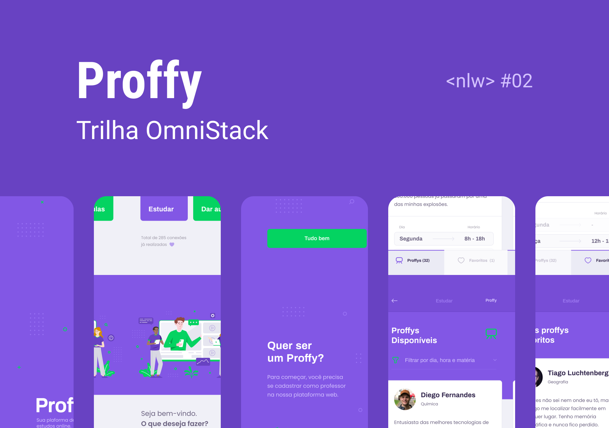
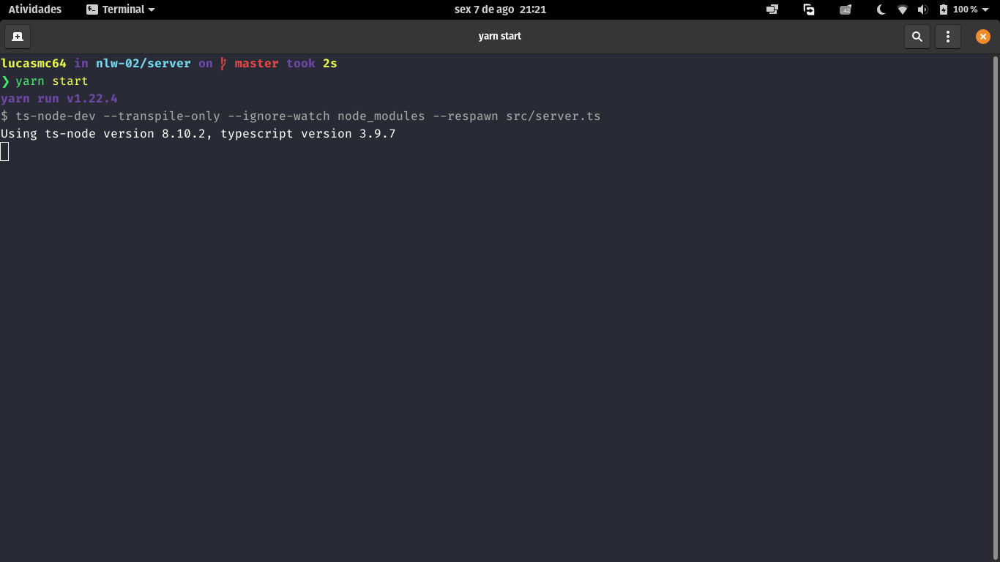
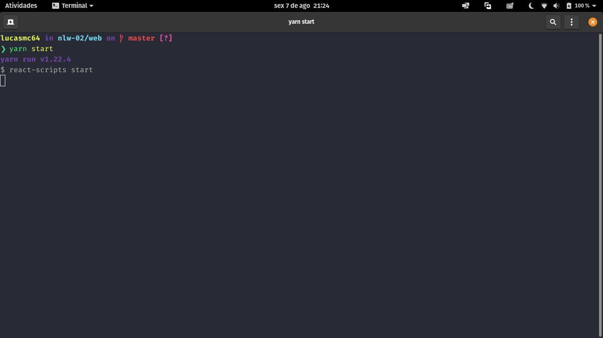
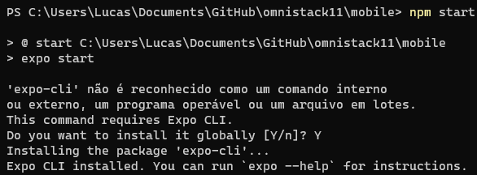
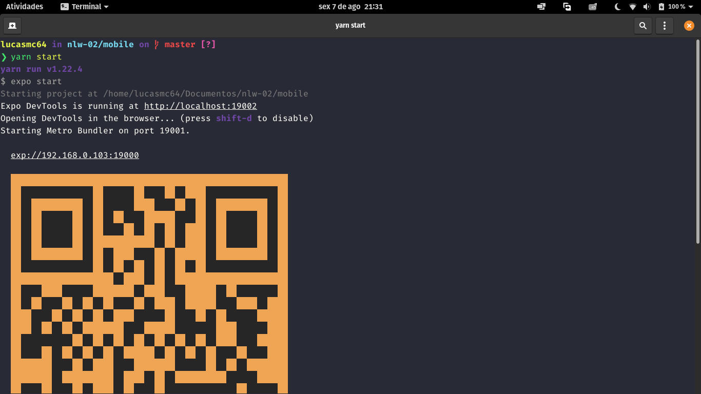
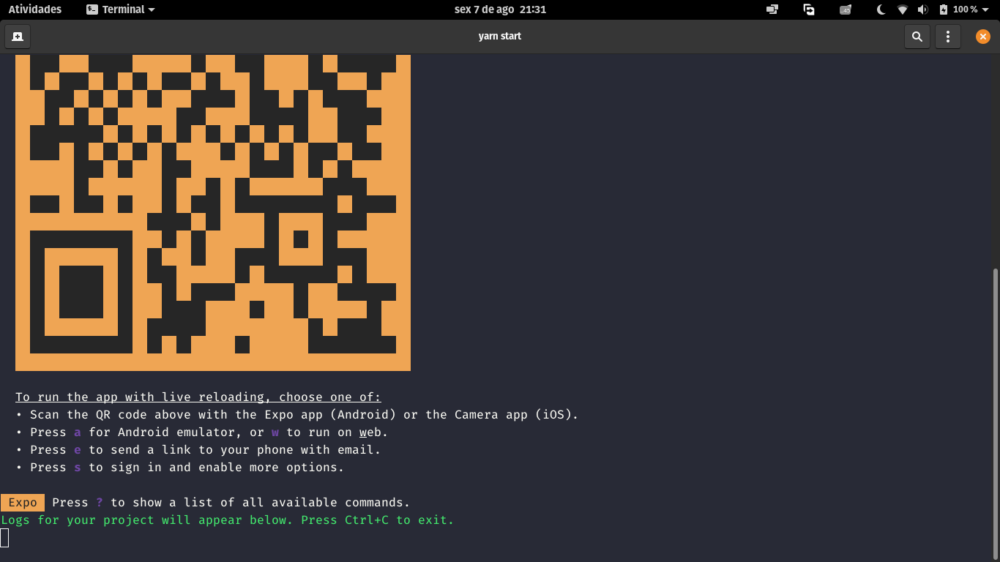
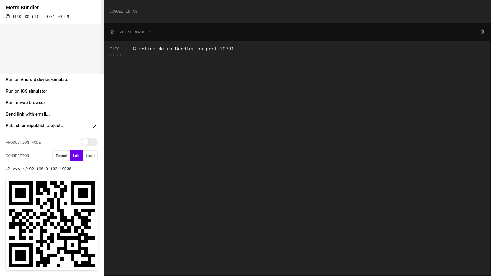
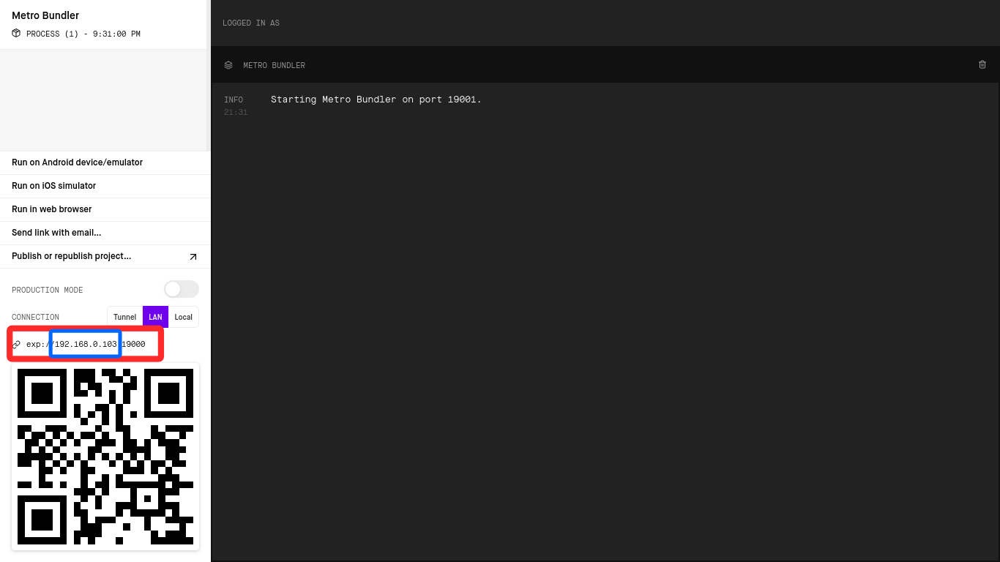

# Proffy &#128218;

*Esse foi um projeto desenvolvido durante a Next Level Week #02 (OmniStack).*

## O que é a Next Level Week? &#128640;

A [NLW](https://nextlevelweek.com/) é uma semana programada pela [Rocketseat](https://rocketseat.com.br/) na qual, através de aulas, lives, prática e com apoio da comunidade, vai te ajudar a dar o próximo passo na sua evolução como dev.

## Qual a diferença entre OmniStack e Discovery? &#9968;

A NLW oferece duas frentes diferentes de acordo com conhecimento do aluno. 

* O caminho “Discovery” é para aqueles que estão no começo do aprendizado em desenvolvimento;
* O caminho “OmniStack” é para aqueles que estão dispostos a ir um pouco mais além e que tem mais conceitos de desenvolvimento fixados. 

## Objetivo &#127919;

Proffy é uma plataforma que visa conectar professores e alunos interessados em aproveitar o EAD da melhor forma possível.

## Alguns detalhes &#128220;

* O backend é construído com Node.JS e SQLite.
* O fontend é construído com o framework ReactJS.
* O mobile é construído com o framework React Native e a plataforma Expo.

## Como rodar o projeto em minha máquina? &#129300;

O primeiro passo é clonar o projeto, seja via terminal ou GitHub Desktop, ou mesmo baixando o arquivo compactado (.zip). Após isso, siga adiante.

### Requisitos &#128736;

* Ter o [Node.JS](https://nodejs.org/) instalado no seu computador.
* (Opcional) Ter o [Yarn](https://yarnpkg.com/) instalado no seu computador.

### Instalando dependências &#128269;

Com o Node.JS instalado, acesse cada um dos diretórios (**server**, **web** e **mobile**) via terminal e rode o comando `npm install`. Caso você prefira usar o Yarn, basta rodar o comando `yarn`.

### Rodando o Backend &#129405;

Acesse o diretório **backend** via terminal e digite `npm start` ou `yarn start` e uma mensagem parecida com a seguinte aparecerá para você:

Obs.: Caso não tenha sido esse o resultado verifique que os requisitos e os passos anteriores tenham sido cumpridos.

### Rodando o Frontend &#10024;

Acesse o diretório **frontend** via terminal e digite `npm start` ou `yarn start` e uma mensagem parecida com a seguinte aparecerá para você:

Automaticamente, em seu navegador padrão, se abrirá uma aba para o link http://localhost:3000/ (onde o projeto estará rodando). Não se esqueça de deixar o backend redando em paralelo!

Obs.: Caso não tenha sido esse o resultado verifique que os requisitos e os passos anteriores tenham sido cumpridos.

### Rodando o Mobile &#128241;

#### Requisitos &#128736;

* Aplicativo Expo instalado no seu smartphone ([Android](https://play.google.com/store/apps/details?id=host.exp.exponent) - [iOS](https://apps.apple.com/br/app/expo-client/id982107779));
* [expo-cli](https://expo.io/learn) (Expo Command Line) instalado no seu computador.

#### Passos &#129406;

Acesse o diretório **mobile** via terminal e digite `npm start` ou `yarn start`. Caso você não tenha instalado o expo-cli até então, aparecerá uma mensagem no terminal te informando isso e perguntando se você deseja instalá-lo. Basta digitar `Y` e dar `ENTER`.

Em seguida (e caso já tivesse o expo-cli instalado), uma mensagem parecida com a seguinte aparecerá para você:

Automaticamente, em seu navegador padrão, se abrirá uma aba para o link http://localhost:9002/ com a seguinte tela:

Como vocês puderam reparar, há um QRCode tanto no terminal, quanto no site que se abriu (ele são iguais). Agora, abra o aplicativo Expo em seu smartphone, escaneie o QRCode e aguarde até que o projeto seja sincronizado.

Obs.: Caso não tenha sido esse o resultado verifique que os requisitos e os passos anteriores tenham sido cumpridos.

### Uns pequenos detalhes... &#129504;

#### Banco de dados &#127922;

Se tudo ocorreu bem até aqui, parabéns! Mas temos mais algumas coisinhas para fazer. Como minha intenção nesse projeto foi meramente educativo, eu subi o projeto juntamente com meu banco de dados de testes. 

O ideal seria, antes de você rodar o projeto no seu computador fazer os seguintes passos:

1. Abrir a pasta */server/src/database/* e deletar o arquivo *database.sqlite*.
2. Abrir o terminal na pasta *server* e digitar o seguinte comando: `npm run knex:migrate` ou `yarn knex:migrate`.

#### Trocando para o seu IP &#128681;

Como estamos rodando o projeto localmente, as rotas são baseadas no IP atual do computador, por isso pode ser necessário trocá-los. Mas como eu sei o meu IP de localhost? Um meio é, quando você rodar o projeto *mobile*, quando abrir a janela do navegador, repare no endereço do lado esquerdo do site ou na barra do navegador:

Acima, no retângulo azul, está o seu IP local atual.

Segue os passos para a substituição:

##### Backend &#129405;

Não há nenhuma linha que precise ser alterada.

##### Frontend &#10024;

Não há nenhuma linha que precise ser alterada.

##### Mobile &#128241;

Acesse a pasta *mobile* e mude o IP nos seguintes arquivos:

* */mobile/src/services/api.ts* - linha 4.

### Se tudo deu certo... &#127881;

Agora você está com um banco de dados novinho em folha e com o **backend**, **frontend** e **mobile** rodando lindamente!
-->